<p align="right">English | <a href="./README_CN.md">简体中文</a></p>  


<p align="center">
  
  
  <h2 align="center"><strong>Is Your HD Map Constructor Reliable under Sensor Corruptions?</strong></h2>

  <p align="center">
    Xiaoshuai Hao<sup>1</sup>&nbsp;&nbsp;&nbsp;
    Mengchuan Wei<sup>1</sup>&nbsp;&nbsp;&nbsp;
    Yifan Yang<sup>1</sup>&nbsp;&nbsp;&nbsp;
    Haimei Zhao</br>
    Hui Zhang<sup>1</sup>&nbsp;&nbsp;&nbsp;
    Yi Zhou<sup>1</sup>&nbsp;&nbsp;&nbsp;
    Qiang Wang<sup>1</sup>&nbsp;&nbsp;&nbsp;
    Weiming Li</br>
    Lingdong Kong<sup>3,‡</sup>&nbsp;&nbsp;&nbsp;
    Jing Zhang<sup>2,‡</sup>
    </br></br>
  <sup>1</sup>Samsung R&D Institute China-Beijing&nbsp;&nbsp;&nbsp;
  <sup>2</sup>The University of Sydney&nbsp;&nbsp;&nbsp;
  <sup>3</sup>National University of Singapore
  </p>

</p>

<p align="center">
  <a href="https://mapbench.github.io/paper.pdf" target='_blank'>
    
  </a>
  
  <a href="https://mapbench.github.io/" target='_blank'>
    
  </a>
  
  <a href="" target='_blank'>
    
  </a>
  
  <a href="" target='_blank'>
    
  </a>
  
  <a href="https://hits.seeyoufarm.com">
    
  </a>
</p>


## About
`MapBench` is the first comprehensive benchmark designed to evaluate the out-of-domain robustness of HD map construction methods against various sensor corruptions.

| 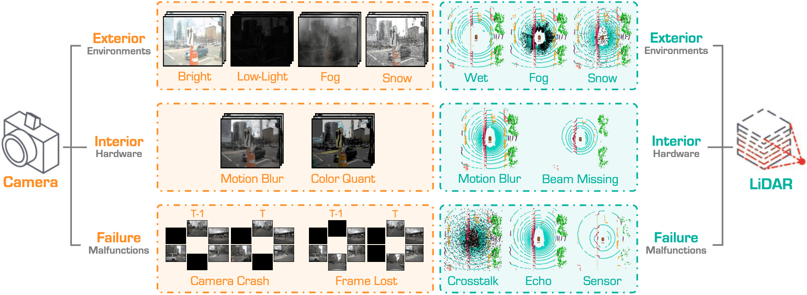 |
| :-: |
| Our benchmark encompasses a total of 16 corruption types for HD map construction, which can be categorized into exterior, interior, and sensor failure scenarios. Besides, we define 13 multi-sensor corruptions by combining the camera and LiDAR sensor failure types. |


## Updates

- \[2024.06\] - Launch of the `MapBench` benchmark. In this version, we include a total of **31** HD map construction models, evaluated on **29** different camera and LiDAR corruption types across **3** severity levels.


## Outline

- [Benchmark Definition](#benchmark-definition)
- [Installation](#installation)
- [Data Preparation](#data-preparation)
- [Getting Started](#getting-started)
- [Model Zoo](#model-zoo)
- [Benchmark](#benchmark)
- [TODO List](#todo-list)
- [Citation](#citation)
- [License](#license)
- [Acknowledgements](#acknowledgements)


## Benchmark Definition

`MapBench` consists of a total of **29** different sensor corruption scenarios, including **8** types of camera corruptions, **8** types of LiDAR corruptions, and **13** types of camera-LiDAR corruption combinations.


### LiDAR Sensor Corruptions

|||||
| :---: | :---: | :---: | :---: |
| 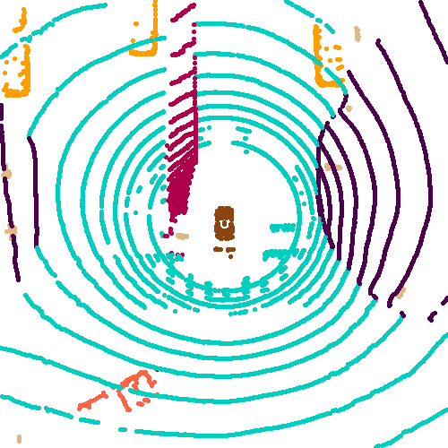 | 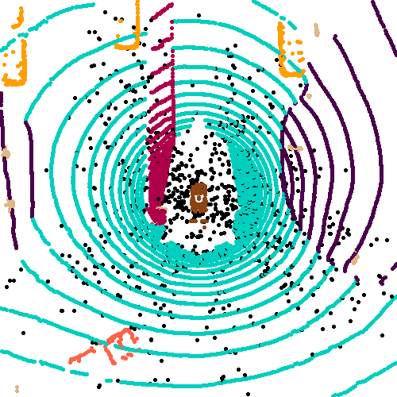 | 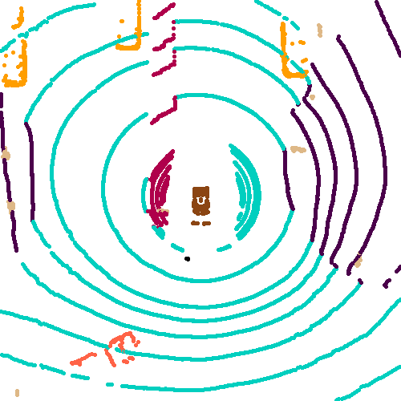 | 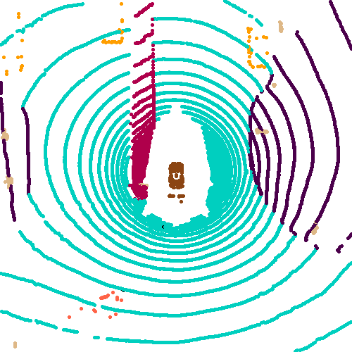 |
| **Wet Ground** | **Snow** | **Beam Missing** | **Incomplete Echo** |
| 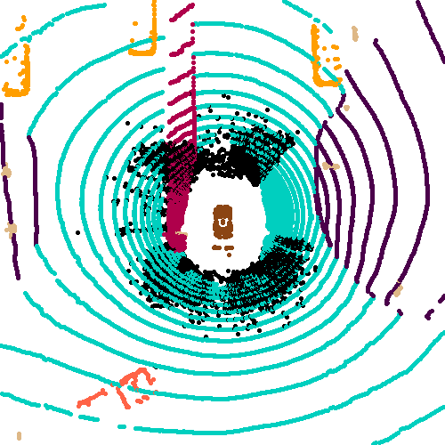 | 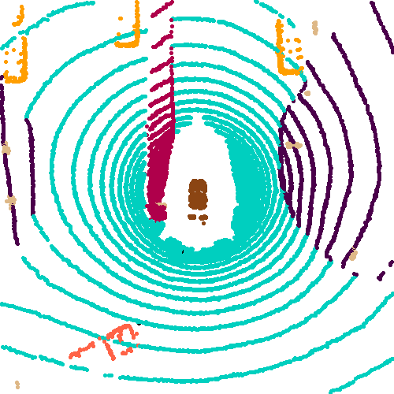 | 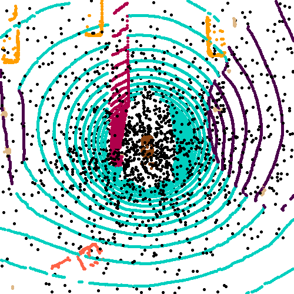 | 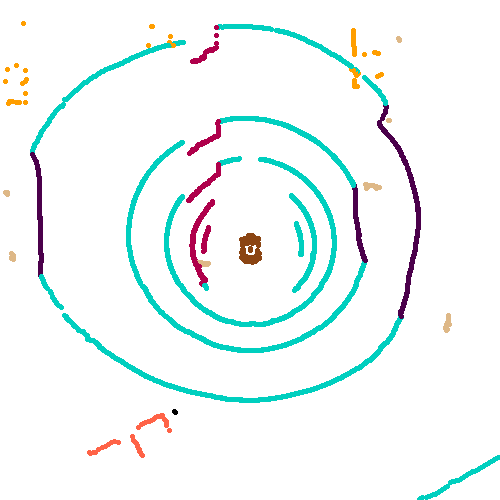 |
| **Fog** | **Motion Blur** | **Crosstalk** | **Cross-Sensor** |
||


### Camera Sensor Corruptions

||||
| :---: | :---: | :---: |
| 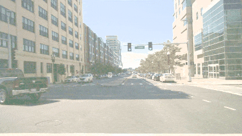 | 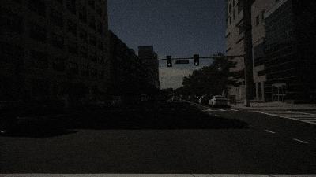 | 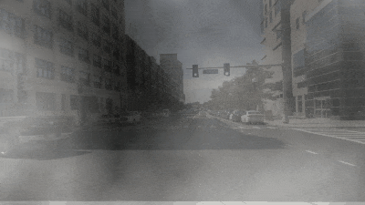 |
| **Brightness** | **Low-Light** | **Fog** |
| 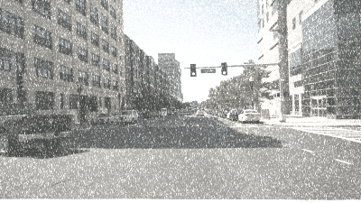 | 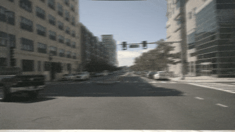 | 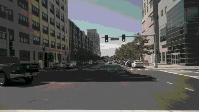 |
| **Snow** | **Motion Blur** | **Color Quant** |
||

### Camera Sensor Failures


## Installation

To be added.


## Data Preparation


## Getting Started


## Model Zoo

<details open>
<summary>&nbsp<b>HD Map Construction</b></summary>

> - [x] **[HDMapNet](https://arxiv.org/abs/2107.06307), ICRA 2022.** <sup>[**`[Code]`**](https://github.com/Tsinghua-MARS-Lab/HDMapNet)</sup>

> - [x] **[VectorMapNet](https://arxiv.org/abs/2206.08920), ICML 2023.** <sup>[**`[Code]`**](https://github.com/Mrmoore98/VectorMapNet_code)</sup>

> - [x] **[MapTR](https://arxiv.org/abs/2208.14437), ICLR 2023.** <sup>[**`[Code]`**](https://github.com/hustvl/MapTR)</sup>

> - [x] **[MapTRv2](https://arxiv.org/abs/2308.05736), arXiv 2023.** <sup>[**`[Code]`**](https://github.com/hustvl/MapTR)</sup>

> - [x] **[PivotNet](https://arxiv.org/pdf/2308.16477), ICCV 2023.** <sup>[**`[Code]`**](https://github.com/wenjie710/PivotNet)</sup>

> - [x] **[BeMapNet](https://openaccess.thecvf.com/content/CVPR2023/html/Qiao_End-to-End_Vectorized_HD-Map_Construction_With_Piecewise_Bezier_Curve_CVPR_2023_paper.html), CVPR 2023.** <sup>[**`[Code]`**](https://github.com/er-muyue/BeMapNet)</sup>

> - [x] **[StreamMapNet](https://arxiv.org/abs/2308.12570), WACV 2024.** <sup>[**`[Code]`**](https://github.com/yuantianyuan01/StreamMapNet)</sup>


> - [x] **[HIMap](https://arxiv.org/abs/2308.12570), CVPR 2024.** <sup>[**`[Code]`**]()</sup>


</details>


## Benchmark

### HD Map construction

The *mean average precision (mAP)* is consistently used as the main indicator for evaluating model performance in our HD Map construction  benchmark. The following two metrics are adopted to compare among models' robustness:
- **mCE (the lower the better):** The *average corruption error* (in percentage) of a candidate model compared to the baseline model, which is calculated among all corruption types across three severity levels.
- **mRR (the higher the better):** The *average resilience rate* (in percentage) of a candidate model compared to its "clean" performance, which is calculated among all corruption types across three severity levels.


### :red_car:&nbsp; Camera-Only Benchmarking Results
<p align="center">
  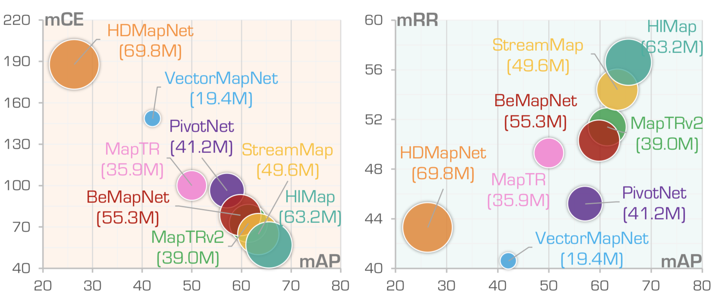
</p>

| Model            | mCE | mRR | Clean  | Camera | Frame | Quant | Motion | Bright | Dark | Fog | Snow |
| :--------------: | :-----: | :-----: |:-----: | :-------: | :--------: | :---------: | :---------: | :----: | :-------: | :----: | :----: |
|**[HDMapNet](https://arxiv.org/abs/2107.06307)**       |18.7.8|43.3|23.0|4.6|5.1|18.9|20.8|16.7|9.3|10.6|5.2|
|**[VectorMapNet](https://arxiv.org/abs/2206.08920)**   |148.5|40.6|40.9|13.9|12.3|26.6|29.7|25.2|7.8|18.3|2.9|
|**[PivotNet](https://arxiv.org/pdf/2308.16477)**       |96.3|45.2|57.4|17.1|16.7|36.4|34.1|43.5|16.5|37.4|4.6|
|**[BeMapNet](https://openaccess.thecvf.com/content/CVPR2023/html/Qiao_End-to-End_Vectorized_HD-Map_Construction_With_Piecewise_Bezier_Curve_CVPR_2023_paper.html)**            |78.5|50.3|59.8|18.8|18.5|38.1|35.3|50.7|23.2|46.5|9.6|
|**[MapTR](https://arxiv.org/abs/2208.14437)**          |100.0|49.3|50.3|15.0|14.2|35.4|23.5|44.3|22.7|38.5|3.8|
|**[MapTRv2](https://arxiv.org/abs/2308.05736)**        |72.6|51.4|61.5|18.8|18.2|45.3|31.0|54.9|32.3|50.7|1.1|
|**[StreamMapNet](https://arxiv.org/abs/2308.12570)**   |64.8|54.4|63.4|13.4|15.5|48.1|44.3|57.0|36.1|52.4|9.1|
|**[HIMap](https://arxiv.org/abs/2308.12570)**          |56.9|56.6|65.5|19.4|19.0|52.0|42.5|60.9|40.6|57.1|5.1|

### :blue_car:&nbsp; LiDAR-Only Benchmarking Results
<p align="center">
  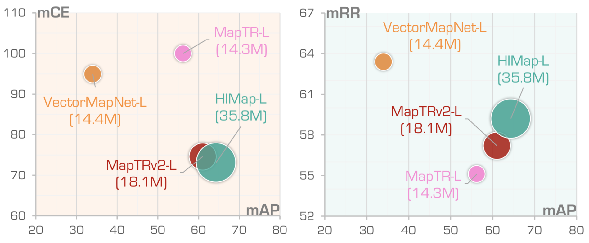
</p>

| Model            | mCE | mRR | Clean  | Fog | Wet | Snow | Motion | Beam | Crosstalk | Echo | Sensor |
| :--------------: | :-----: | :-----: |:-----: | :-------: | :--------: | :---------: | :---------: | :----: | :-------: | :----: | :----: |
|**[VectorMapNet](https://arxiv.org/abs/2206.08920)**  |94.9|63.4|34.0|15.7|20.3|15.9|28.8|19.2|19.7|31.3|9.5|
|**[MapTR](https://arxiv.org/abs/2208.14437)**                       |100.0|55.1|55.6|19.9|19.1|9.6|27.1|16.5|16.3|32.3|6.4|
|**[MapTRv2](https://arxiv.org/abs/2308.05736)**                     |74.6|57.2|61.5|28.5|29.5|10.3|36.9|27.9|15.4|44.7|14.0|
|**[HIMap](https://arxiv.org/abs/2308.12570)**                       |73.1|59.2|64.3|26.6|24.6|16.1|37.4|24.4|26.7|43.1|10.8|

### :taxi:&nbsp; Camera-LiDAR Fusion Benchmarking Results
<p align="center">
  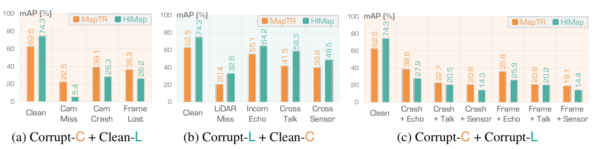
</p>

| Model            | Modality | Camera | Lidar  | AP<sub>ped</sub> | AP<sub>div</sub> | AP<sub>bou</sub> | mAP | 
| :--------------: | :-----: | :-----: |:-----: | :-------: | :--------: | :---------: | :---------: |
|**[MapTR](https://arxiv.org/abs/2208.14437)**  | C & L | ✓          | ✓             |55.9|62.3|69.3|62.5|
|**[MapTR](https://arxiv.org/abs/2208.14437)**  |   C   | ✓          |  —            |46.3|51.5|53.1|50.3|
|**[MapTR](https://arxiv.org/abs/2208.14437)**  |   C   |Camera Crash |  —            |18.0|14.5|12.4|15.0|
|**[MapTR](https://arxiv.org/abs/2208.14437)**  |   C   |Frame Lost   |  —            |13.9|15.1|13.4|14.2|
|**[MapTR](https://arxiv.org/abs/2208.14437)**  | C & L | ✗          |  —            |15.0|18.2|34.4|22.5|
|**[MapTR](https://arxiv.org/abs/2208.14437)**  | C & L |Camera Crash |  —            |32.5|36.5|48.4|39.1|
|**[MapTR](https://arxiv.org/abs/2208.14437)**  | C & L |Frame Lost   |  —            |29.1|33.7|46.1|36.3|
|**[MapTR](https://arxiv.org/abs/2208.14437)**  |   L   | —           | ✓            |26.6|31.7|41.8|33.4|
|**[MapTR](https://arxiv.org/abs/2208.14437)**  |   L   | —           |Incomplete Echo|26.3|29.9|40.6|32.3|
|**[MapTR](https://arxiv.org/abs/2208.14437)**  |   L   | —           |Crosstalk      |13.6|15.0|20.3|16.3|
|**[MapTR](https://arxiv.org/abs/2208.14437)**  |   L   | —           |Cross-Sensor   |3.5|6.6|8.9|6.4|
|**[MapTR](https://arxiv.org/abs/2208.14437)**  | C & L | ✓          | ✗          |20.7|27.4|13.1|20.4|
|**[MapTR](https://arxiv.org/abs/2208.14437)**  | C & L | ✓          |Incomplete Echo|47.9|55.2|62.2|55.1|
|**[MapTR](https://arxiv.org/abs/2208.14437)**  | C & L | ✓          |Crosstalk      |36.7|42.5|45.3|41.5|
|**[MapTR](https://arxiv.org/abs/2208.14437)** | C & L | ✓          |Cross-Sensor   |33.9|42.9|42.0|39.6|
|**[MapTR](https://arxiv.org/abs/2208.14437)**  | C & L |Camera Crash |Incomplete Echo|32.4|35.6|47.8|38.6|
|**[MapTR](https://arxiv.org/abs/2208.14437)**  | C & L |Camera Crash |Crosstalk      |19.7|21.6|26.9|22.7|
|**[MapTR](https://arxiv.org/abs/2208.14437)**  | C & L |Camera Crash |Cross-Sensor   |18.4|20.8|23.2|20.8|
|**[MapTR](https://arxiv.org/abs/2208.14437)**  | C & L |Frame Lost   |Incomplete Echo|28.9|32.8|45.5|35.8|
|**[MapTR](https://arxiv.org/abs/2208.14437)**  | C & L |Frame Lost   |Crosstalk      |16.9|19.9|25.5|20.8|
|**[MapTR](https://arxiv.org/abs/2208.14437)**  | C & L |Frame Lost   |Cross-Sensor   |15.8|19.4|22.2|19.1|

| Model            | Modality | Camera | Lidar  | AP<sub>ped</sub> | AP<sub>div</sub> | AP<sub>bou</sub> | mAP | 
| :--------------: | :-----: | :-----: |:-----: | :-------: | :--------: | :---------: | :---------: |
|**[HIMap](https://arxiv.org/abs/2308.12570)**   | C & L | ✓          | ✓              |71.0|72.4|79.4|74.3|
|**[HIMap](https://arxiv.org/abs/2308.12570)**    |   C   | ✓          |  —            |62.2|66.5|67.9|65.5|
|**[HIMap](https://arxiv.org/abs/2308.12570)**   |   C   |Camera Crash |  —            |27.3|19.4|11.6|19.4|
|**[HIMap](https://arxiv.org/abs/2308.12570)**    |   C   |Frame Lost   |  —            |21.7|19.1|16.1|19.0|
|**[HIMap](https://arxiv.org/abs/2308.12570)**    | C & L | ✗          |  —            |40.9|46.4|74.7|50.7|
|**[HIMap](https://arxiv.org/abs/2308.12570)**    | C & L |Camera Crash |  —            |36.3|27.7|20.9|28.3|
|**[HIMap](https://arxiv.org/abs/2308.12570)**    | C & L |Frame Lost   |  —            |29.9|25.0|23.8|26.2|
|**[HIMap](https://arxiv.org/abs/2308.12570)**    |   L   | —           | ✓            |54.8|64.7|73.5|64.3|
|**[HIMap](https://arxiv.org/abs/2308.12570)**    |   L   | —           |Incomplete Echo|35.4|41.1|52.7|43.1|
|**[HIMap](https://arxiv.org/abs/2308.12570)**    |   L   | —           |Crosstalk      |20.9|23.8|35.3|26.7|
|**[HIMap](https://arxiv.org/abs/2308.12570)**    |   L   | —           |Cross-Sensor   |7.8|10.2|14.4|10.8|
|**[HIMap](https://arxiv.org/abs/2308.12570)**    | C & L | ✓          | ✗          |30.7|38.7|29.0|32.8|
|**[HIMap](https://arxiv.org/abs/2308.12570)**    | C & L | ✓          |Incomplete Echo|59.1|63.7|69.9|64.2|
|**[HIMap](https://arxiv.org/abs/2308.12570)**    | C & L | ✓          |Crosstalk      |54.1|57.5|63.4|58.3|
|**[HIMap](https://arxiv.org/abs/2308.12570)**    | C & L | ✓          |Cross-Sensor   |44.2|50.7|50.8|48.5|
|**[HIMap](https://arxiv.org/abs/2308.12570)**    | C & L |Camera Crash |Incomplete Echo|36.2|26.9|20.5|27.9|
|**[HIMap](https://arxiv.org/abs/2308.12570)**    | C & L |Camera Crash |Crosstalk      |29.2|19.3|12.9|20.5|
|**[HIMap](https://arxiv.org/abs/2308.12570)**    | C & L |Camera Crash |Cross-Sensor   |23.1|13.8|5.9|14.3|
|**[HIMap](https://arxiv.org/abs/2308.12570)**    | C & L |Frame Lost   |Incomplete Echo|29.9|24.4|23.5|25.9|
|**[HIMap](https://arxiv.org/abs/2308.12570)**    | C & L |Frame Lost   |Crosstalk      |23.6|18.9|18.0|20.2|
|**[HIMap](https://arxiv.org/abs/2308.12570)**   | C & L |Frame Lost   |Cross-Sensor   |17.7|14.3|11.2|14.4|


## TODO List
- [x] Initial release. 🚀
- [ ] Add scripts for creating common corruptions.
- [ ] Add evaluation scripts on corruption sets.
- [ ] ...


## Citation
If you find this work helpful, please kindly consider citing our paper:

```bibtex
@inproceedings{kong2023robo3d,
    author = {Lingdong Kong and Youquan Liu and Xin Li and Runnan Chen and Wenwei Zhang and Jiawei Ren and Liang Pan and Kai Chen and Ziwei Liu},
    title = {Robo3D: Towards Robust and Reliable 3D Perception against Corruptions},
    booktitle = {Proceedings of the IEEE/CVF International Conference on Computer Vision (ICCV)},
    pages = {19994--20006},
    year = {2023},
}
```
```bibtex
@misc{kong2023robo3d_benchmark,
  title = {The Robo3D Benchmark for Robust and Reliable 3D Perception},
  author = {Lingdong Kong and Youquan Liu and Xin Li and Runnan Chen and Wenwei Zhang and Jiawei Ren and Liang Pan and Kai Chen and Ziwei Liu},
  howpublished = {\url{https://github.com/ldkong1205/Robo3D}},
  year = {2023},
}
```


## License
<a rel="license" href="http://creativecommons.org/licenses/by-nc-sa/4.0/"></a>
<br />
This work is under the <a rel="license" href="http://creativecommons.org/licenses/by-nc-sa/4.0/">Creative Commons Attribution-NonCommercial-ShareAlike 4.0 International License</a>, while some specific operations in this codebase might be with other licenses. Please refer to [LICENSE.md](docs/LICENSE.md) for a more careful check, if you are using our code for commercial matters.


## Acknowledgements


